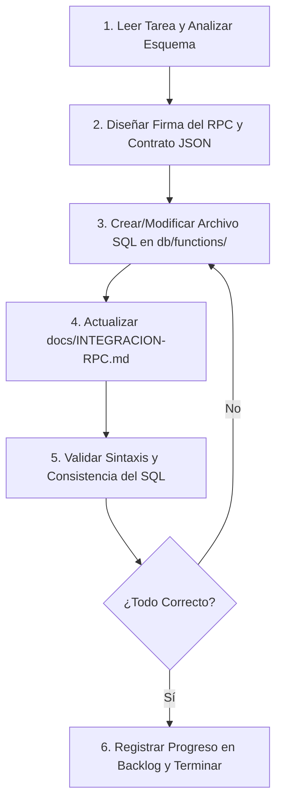

# Ciclo de Vida del Agente (Agent Loop) y Backlog de Tareas de Base de Datos

**Proyecto:** LogiTrack  
**Propósito:** Definir el proceso iterativo que deben seguir los agentes de IA (u otros programadores de base de datos) para implementar funciones SQL en Supabase, y listar el backlog priorizado de tareas del sistema.

---

## 1. El Ciclo de Operación del Agente (Agent Loop)

Cada vez que comiences a trabajar en una tarea de base de datos, debes ejecutar el siguiente ciclo iterativo para asegurar consistencia, prevenir regresiones y garantizar una excelente experiencia para el desarrollador del Front/Backend.

### Paso a paso:

1. **Leer Tarea y Analizar Esquema:** Revisa el requerimiento del negocio y busca las tablas implicadas en [docs/Tablas.md](file:///d:/ProyectosWeb/LogiTrack/docs/Tablas.md) o [assets/docs/Estructuras de tablas.txt](file:///d:/ProyectosWeb/LogiTrack/assets/docs/Estructuras%20de%20tablas.txt).
2. **Diseñar Firma del RPC y Contrato JSON:** Define qué parámetros requiere la función (prefijo `p_`) y cómo estructurará el JSON de retorno (siguiendo el estándar de [docs/SUPABASE-SDD.md](file:///d:/ProyectosWeb/LogiTrack/docs/SUPABASE-SDD.md)).
3. **Crear/Modificar Archivo SQL:** Escribe el script SQL correspondiente en la carpeta `db/functions/`. Usa sentencias `CREATE OR REPLACE FUNCTION`.
4. **Actualizar Guía de Integración:** Añade o actualiza la sección correspondiente de la función en [docs/INTEGRACION-RPC.md](file:///d:/ProyectosWeb/LogiTrack/docs/INTEGRACION-RPC.md) con ejemplos claros de código para el cliente de Supabase.
5. **Validar Sintaxis y Consistencia:** Haz una revisión de linter mental o simulada del código SQL. Asegura que los tipos coincidan y que los bloques `EXCEPTION` capturen posibles errores.
6. **Registrar Progreso:** Cambia el estado de la tarea en este backlog a completada (`[x]`).

---

## 2. Backlog de Tareas de Base de Datos (LogiTrack)

Este es el backlog oficial de las tareas de base de datos pendientes para el sistema logístico de LogiTrack. Las tareas deben ejecutarse en orden secuencial debido a dependencias entre módulos.

### Módulo de Distribución y Flujo de Inventario (Prioridad Alta)

- `[ ]` **Tarea DB-001: Crear Orden de Distribución con Detalles (`crear_orden_distribucion`)**
  - **Función:** Inserta de forma atómica una orden (`ordenes_distribucion`) y su detalle correspondiente (`detalle_distribucion`).
  - **Inputs:** `p_cliente_id UUID`, `p_camion_id UUID`, `p_chofer_id UUID`, `p_factura_origen_numero VARCHAR`, `p_creado_por UUID`, `p_detalles JSONB` (Lista de items con `producto_id`, `cantidad`, `valor_unitario`).
  - **Comportamiento:** Valida que el cliente, camión y chofer estén registrados y activos. Calcula el peso total de la orden multiplicando la cantidad de productos por su peso en la tabla `productos`. Inserta la cabecera, autogenerando el correlativo, e inserta las líneas de detalles en secuencia.
  - **Output:** JSON `{ success: boolean, data: { orden_id: UUID, correlativo: INT, peso_total_calculado: NUMERIC }, error: object }`.

- `[ ]` **Tarea DB-002: Reserva de Stock en Almacén (`reservar_stock_orden`)**
  - **Función:** Transiciona una orden al estado `lista_para_carga` y compromete el stock físico en el almacén principal.
  - **Inputs:** `p_orden_id UUID`.
  - **Comportamiento:** Valida que el estado actual sea `borrador`. Para cada línea de detalle, verifica si hay suficiente `stock_disponible` en `inventario_almacen`. Si la verificación es exitosa:
    1. Resta la cantidad solicitada de `stock_disponible`.
    2. Suma la cantidad solicitada a `stock_comprometido`.
    3. Cambia el estado de la orden a `lista_para_carga`.
  - **Output:** JSON `{ success: boolean, data: { orden_id: UUID, nuevo_estado: "lista_para_carga" }, error: object }`.

- `[ ]` **Tarea DB-003: Carga a Inventario Móvil (`cargar_inventario_movil`)**
  - **Función:** Transiciona una orden al estado `en_transito` y traspasa los productos del almacén principal al camión.
  - **Inputs:** `p_orden_id UUID`.
  - **Comportamiento:** Valida que la orden esté en `lista_para_carga`. Para cada producto del detalle:
    1. Resta la cantidad de `stock_comprometido` en `inventario_almacen` (ya que sale físicamente del almacén).
    2. Inserta o actualiza un registro en `inventario_movil` para el `camion_id` asociado a la orden, sumando la cantidad despachada al campo `cantidad_cargada`.
    3. Actualiza el estado de la orden a `en_transito`.
    4. Cambia el estado del camión y del chofer asignado a `en_ruta`.
  - **Output:** JSON `{ success: boolean, data: { orden_id: UUID, nuevo_estado: "en_transito" }, error: object }`.

- `[ ]` **Tarea DB-004: Registro de Entregas y Devoluciones en Ruta (`registrar_entrega_detalle`)**
  - **Función:** Registra el resultado del despacho de una línea específica durante la ruta del chofer.
  - **Inputs:** `p_detalle_id UUID` (ID de la línea), `p_cantidad_despachada INT` (entregada), `p_estado_entrega TEXT` ('entregado', 'entregado_parcial', 'rechazado'), `p_motivo_rechazo TEXT`.
  - **Comportamiento:** Valida que la orden asociada al detalle esté en estado `en_transito`.
    1. Actualiza `cantidad_despachada`, `estado_entrega` y `motivo_rechazo` en `detalle_distribucion`.
    2. Actualiza `inventario_movil` para el camión de la orden:
       - Suma `p_cantidad_despachada` a `cantidad_entregada`.
       - Calcula la diferencia (`cantidad_solicitada - p_cantidad_despachada`) y la suma a `cantidad_devolucion`.
  - **Output:** JSON `{ success: boolean, data: { detalle_id: UUID, estado_entrega: TEXT }, error: object }`.

- `[ ]` **Tarea DB-005: Liquidación de Despacho (`liquidar_orden_distribucion`)**
  - **Función:** Cierra la orden de distribución una vez que el chofer regresa y devuelve el stock rechazado/no entregado al almacén principal.
  - **Inputs:** `p_orden_id UUID`.
  - **Comportamiento:** Valida que la orden esté en `en_transito` y que todas sus líneas estén en un estado final de entrega (distinto de 'pendiente').
    1. Por cada línea de detalle de la orden con devoluciones:
       - Suma la cantidad rechazada (`cantidad_solicitada - cantidad_despachada`) al `stock_disponible` en `inventario_almacen`.
       - En `inventario_movil` del camión, resta la cantidad cargada correspondiente a este despacho para liberar espacio lógico del camión.
    2. Cambia el estado de la orden a `liquidada`.
    3. Cambia el estado del camión y del chofer a `disponible`.
  - **Output:** JSON `{ success: boolean, data: { orden_id: UUID, nuevo_estado: "liquidada" }, error: object }`.

- `[ ]` **Tarea DB-006: Anulación de Orden (`anular_orden_distribucion`)**
  - **Función:** Cancela la orden y revierte cualquier asignación de inventario realizada.
  - **Inputs:** `p_orden_id UUID`.
  - **Comportamiento:**
    - Si la orden está en `borrador`: cambia el estado directamente a `anulada`.
    - Si la orden está en `lista_para_carga`: reversa las reservas de inventario (resta de `stock_comprometido` y suma a `stock_disponible` en `inventario_almacen` para cada producto del detalle) y cambia a `anulada`.
    - Si está en `en_transito` o `liquidada`: bloquea la acción (no se puede anular una orden cargada al camión o ya liquidada sin un procedimiento de devolución formal).
  - **Output:** JSON `{ success: boolean, data: { orden_id: UUID, nuevo_estado: "anulada" }, error: object }`.

### Módulo de Seguridad y Auditoría (Prioridad Media)

- `[ ]` **Tarea DB-007: Configuración de RLS y Funciones de Seguridad**
  - **Función:** Crear triggers de auditoría automática en tablas críticas e implementar funciones auxiliares para validar el rol del usuario autenticado actual desde el cliente de Supabase.
  - **Detalle:**
    1. Crear función trigger `audit_changes_trigger()` que inserte registros en `logs_auditoria` con valores anteriores y nuevos al hacer INSERT/UPDATE/DELETE.
    2. Crear políticas RLS en `ordenes_distribucion` para que un chofer (`chofer_cobrador`) solo pueda leer las órdenes asignadas a su `chofer_id` (que mapea a su ID de usuario en auth).
