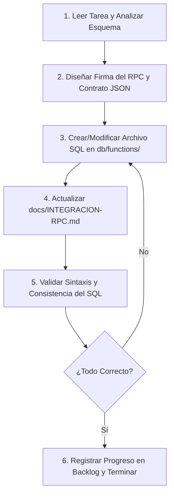

# Ciclo de Vida del Agente (Agent Loop) y Backlog de Tareas de Base de Datos

**Proyecto:** LogiTrack  
**Propósito:** Definir el proceso iterativo que deben seguir los agentes de IA (u otros programadores de base de datos) para implementar funciones SQL en Supabase, y listar el backlog priorizado de tareas del sistema.

---

## 1. El Ciclo de Operación del Agente (Agent Loop)

Cada vez que comiences a trabajar en una tarea de base de datos, debes ejecutar el siguiente ciclo iterativo para asegurar consistencia, prevenir regresiones y garantizar una excelente experiencia para el desarrollador del Front/Backend.

```mermaid
graph TD
    A[1. Leer Tarea y Analizar Esquema] --> B[2. Diseñar Firma del RPC y Contrato JSON]
    B --> C[3. Crear/Modificar Archivo SQL en db/functions/]
    C --> D[4. Actualizar docs/INTEGRACION-RPC.md]
    D --> E[5. Validar Sintaxis y Consistencia del SQL]
    E --> F{¿Todo Correcto?}
    F -- No --> C
    F -- Sí --> G[6. Registrar Progreso en Backlog y Terminar]
```

### Paso a paso:

1. **Leer Tarea y Analizar Esquema:** Revisa el requerimiento del negocio y busca las tablas implicadas en [docs/Tablas.md](file:///d:/ProyectosWeb/LogiTrack/docs/Tablas.md) o [assets/docs/Estructuras de tablas.txt](file:///d:/ProyectosWeb/LogiTrack/assets/docs/Estructuras%20de%20tablas.txt).
2. **Diseñar Firma del RPC y Contrato JSON:** Define qué parámetros requiere la función (prefijo `p_`) y cómo estructurará el JSON de retorno (siguiendo el estándar de [docs/SUPABASE-SDD.md](file:///d:/ProyectosWeb/LogiTrack/docs/SUPABASE-SDD.md)).
3. **Crear/Modificar Archivo SQL:** Escribe el script SQL correspondiente en la carpeta `db/functions/`. Usa sentencias `CREATE OR REPLACE FUNCTION`.
4. **Actualizar Guía de Integración:** Añade o actualiza la sección correspondiente de la función en [docs/INTEGRACION-RPC.md](file:///d:/ProyectosWeb/LogiTrack/docs/INTEGRACION-RPC.md) con ejemplos claros de código para el cliente de Supabase.
5. **Validar Sintaxis y Consistencia:** Haz una revisión de linter mental o simulada del código SQL. Asegura que los tipos coincidan y que los bloques `EXCEPTION` capturen posibles errores.
6. **Registrar Progreso:** Cambia el estado de la tarea en este backlog a completada (`[x]`).

---

## 2. Backlog de Tareas de Base de Datos (LogiTrack)

Este es el backlog oficial de las tareas de base de datos pendientes para el sistema logístico de LogiTrack. Las tareas deben ejecutarse en orden secuencial debido a dependencias entre módulos.

### Módulo de Distribución y Flujo de Inventario (Prioridad Alta)

- `[x]` **Tarea DB-000: Aplicar Cambios Estructurales en la Base de Datos (Migraciones)**
  - **Función:** Aplicar el esquema DDL aprobado en [docs/PROPOSICION-CAMBIOS-DB.md](file:///d:/ProyectosWeb/LogiTrack/docs/PROPOSICION-CAMBIOS-DB.md) para habilitar el doble inventario de contenedores y los nuevos estados de la orden.
  - **Comportamiento:**
    1. Crear la tabla maestra `tipos_contenedores` y el saldo por cliente `saldo_contenedores_clientes`.
    2. Modificar la tabla `productos` para relacionarla a contenedores.
    3. Crear la tabla de transacciones `movimientos_contenedores`.
    4. Actualizar la restricción CHECK del estado en `ordenes_distribucion` para añadir `por_liquidar`.
  - **Output:** Estructura de base de datos de Supabase actualizada con éxito.

- `[x]` **Tarea DB-002: Aprobación de Orden y Reserva de Stock (`aprobar_orden_distribucion`)**
  - **Función:** Transiciona una orden al estado `aprobada` (Gerente aprueba) y compromete el stock físico en el almacén principal.
  - **Inputs:** `p_orden_id UUID`.
  - **Comportamiento:** Valida que el estado actual sea `borrador`. Para cada línea de detalle, verifica si hay suficiente `stock_disponible` en `inventario_almacen`. Si la verificación es exitosa:
    1. Resta la cantidad solicitada de `stock_disponible`.
    2. Suma la cantidad solicitada a `stock_comprometido`.
    3. Cambia el estado de la orden a `aprobada`.
  - **Output:** JSON `{ success: boolean, data: { orden_id: UUID, nuevo_estado: "aprobada" }, error: object }`.

- `[x]` **Tarea DB-003: Carga a Inventario Móvil (`cargar_inventario_movil`)**
  - **Función:** Transiciona una orden al estado `en_transito` y traspasa los productos del almacén principal al camión.
  - **Inputs:** `p_orden_id UUID`.
  - **Comportamiento:** Valida que la orden esté en `aprobada`. Para cada producto del detalle:
    1. Resta la cantidad de `stock_comprometido` en `inventario_almacen` (sale físicamente del almacén).
    2. Inserta o actualiza un registro en `inventario_movil` para el `camion_id` (por ID de camión) asociado a la orden, sumando la cantidad despachada al campo `cantidad_cargada`.
    3. Actualiza el estado de la orden a `en_transito`.
    4. Cambia el estado del camión y del chofer asignado a `en_ruta`.
  - **Output:** JSON `{ success: boolean, data: { orden_id: UUID, nuevo_estado: "en_transito" }, error: object }`.

- `[x]` **Tarea DB-004: Registro de Entregas y Devoluciones (`registrar_entrega_detalle`)**
  - **Función:** Registra el resultado del despacho de una línea de producto específica en ruta por parte del chofer (Radar).
  - **Inputs:** `p_detalle_id UUID`, `p_cantidad_despachada INT` (entregada), `p_estado_entrega TEXT`, `p_motivo_rechazo TEXT`.
  - **Comportamiento:** Valida que la orden asociada esté en estado `en_transito`.
    1. Actualiza `cantidad_despachada`, `estado_entrega` y `motivo_rechazo` en `detalle_distribucion`.
    2. Actualiza `inventario_movil` para el camión de la orden:
       - Suma `p_cantidad_despachada` a `cantidad_entregada`.
       - Calcula la diferencia (`cantidad_solicitada - p_cantidad_despachada`) y la suma a `cantidad_devolucion`.
    3. Si todas las líneas de detalle de la orden han sido procesadas (tienen un estado diferente a 'pendiente'), cambia el estado de la orden a `por_liquidar`.
  - **Output:** JSON `{ success: boolean, data: { detalle_id: UUID, estado_entrega: TEXT, orden_estado: TEXT }, error: object }`.

- `[x]` **Tarea DB-004b: Registrar Movimiento de Contenedores en Ruta (`registrar_movimiento_contenedores`)**
  - **Función:** Registra las entregas y retiros físicos de envases/contenedores retornables realizados por el despachador para un cliente y orden.
  - **Inputs:** `p_cliente_id UUID`, `p_orden_id UUID`, `p_contenedor_id UUID`, `p_cantidad_entregada INT`, `p_cantidad_retirada INT`, `p_creado_por UUID`.
  - **Comportamiento:** Registra la transacción en `movimientos_contenedores`.
  - **Output:** JSON `{ success: boolean, data: { movimiento_id: UUID }, error: object }`.

- `[x]` **Tarea DB-005: Aprobación de Recaudación y Liquidación (`liquidar_orden_distribucion`)**
  - **Función:** Cierra la orden financieramente y consolida el saldo de contenedores cuando el gerente aprueba la recaudación.
  - **Inputs:** `p_orden_id UUID`.
  - **Comportamiento:**
    1. Valida que la orden esté en `por_liquidar`.
    2. Valida que exista una recaudación aprobada (`rendiciones_cuentas.estado = 'aprobada'`) vinculada a esta orden en `detalle_rendicion_ordenes` y que el monto recaudado cubra la cobranza requerida. Si no, lanza error `COBRANZA_PENDIENTE`.
    3. Por cada línea de detalle:
       - Suma la cantidad devuelta/rechazada a `stock_disponible` en `inventario_almacen` y la resta de `inventario_movil` del camión.
    4. Por cada movimiento registrado en `movimientos_contenedores` para esta orden:
       - Actualiza `saldo_contenedores_clientes` del cliente sumando `cantidad_entregada` y restando `cantidad_retirada`.
    5. Cambia el estado de la orden a `liquidada` y libera camión/chofer a `disponible`.
  - **Output:** JSON `{ success: boolean, data: { orden_id: UUID, nuevo_estado: "liquidada" }, error: object }`.

- `[x]` **Tarea DB-006: Anulación de Orden (`anular_orden_distribucion`)**
  - **Función:** Cancela la orden y revierte cualquier asignación de inventario realizada.
  - **Inputs:** `p_orden_id UUID`.
  - **Comportamiento:**
    - Si la orden está en `borrador`: cambia el estado directamente a `anulada`.
    - Si la orden está en `aprobada`: reversa las reservas de inventario (resta de `stock_comprometido` y suma a `stock_disponible` en `inventario_almacen` para cada producto del detalle) y cambia a `anulada`.
    - Si está en `en_transito` o `liquidada`: bloquea la acción.
  - **Output:** JSON `{ success: boolean, data: { orden_id: UUID, nuevo_estado: "anulada" }, error: object }`.

### Módulo de Seguridad y Auditoría (Prioridad Media)

- `[x]` **Tarea DB-007: Configuración de RLS y Funciones de Seguridad**
  - **Función:** Crear triggers de auditoría automática en tablas críticas e implementar funciones auxiliares para validar el rol del usuario autenticado actual desde el cliente de Supabase.
  - **Detalle:**
    1. Crear función trigger `audit_changes_trigger()` que inserte registros en `logs_auditoria` con valores anteriores y nuevos al hacer INSERT/UPDATE/DELETE.
    2. Crear políticas RLS en `ordenes_distribucion` para que un chofer (`chofer_cobrador`) solo pueda leer las órdenes asignadas a su `chofer_id` (que mapea a su ID de usuario en auth).

### Módulo de Rendición de Cuentas y Crédito (Prioridad Alta)

- `[x]` **Tarea DB-008: Registro de Rendición de Cuentas (`registrar_rendicion_cuentas`)**
  - **Función:** Registra de forma atómica la recaudación asociando múltiples órdenes y formas de pago, gestionando automáticamente el saldo a favor del cliente y el trigger de liquidación de órdenes.
  - **Inputs:** `p_cliente_id UUID`, `p_observaciones TEXT`, `p_creado_por UUID`, `p_ordenes JSONB`, `p_pagos JSONB`.
  - **Comportamiento:** Registra la cabecera en `rendiciones_cuentas` y los detalles en `detalle_rendicion_ordenes` y `detalle_rendicion_fpagos`. Si la suma de los pagos supera lo recaudado de las órdenes, calcula y abona la diferencia como crédito en `saldo_favor` del cliente.
  - **Output:** JSON `{ success: boolean, data: { rendicion_id: UUID, total_ordenes: NUMERIC, total_pagos: NUMERIC, saldo_favor_generado: NUMERIC }, error: object }`.

  ### Tabla formas de pago 

- `[x]` **Tarea DB-009: Creación de tabla fpagos con las distintas formas de pago**
  - **Función:** Registros con formas de pago para ser utilizado en el módulo de Rendición de cuentas y pago a proveedores
  - **Inputs:** `fpago_id UUID PK, fpago_concepto TEXT, fpago_info BOOLEAN`.
  - **Registros:** Insertar los siguientes registros: `Pago movil`, .T.; `Transferencia`,.T.;`Efectivo Bs`, .F.; `Efectivo USD`, .F.; `ZELLE`, .T.;`BINANCE`,.T.
  - **Output:** No OUTPUT

  ### Foreign Key 

- `[x]` **Tarea DB-010: Creación de un foreign key en la tabla detalle_rendicion_fpagos**
  - **Función:** Solo almacenar en la tabla detalle_rendicion_fpagos el fpago_id. Eliminar el campo metodo_pago. (Nota: Se actualizaron `registrar_rendicion_cuentas` y `cargar_datos_demo_dashboard` para usar `fpago_id`).
  
### Consulta a la tabla formas de pago

- `[x]` **Tarea DB-011: Crear Function consulta_registros_formas_pago, en Supabase para consultar todos los registros de la tabla fpagos (`Retorna_`)**
  - **Función:** Retorna todos los campos de todos los registros de la tabla fpagos
  - **Inputs:** No hay Inputs.
  - **Output:** JSON (Estructura: `{ "success": true, "data": [{"fpago_id": "...", "fpago_concepto": "...", "fpago_info": ...}], "error": null }`) 

### Control de Acceso y Modificación de Órdenes

- `[x]` **Tarea DB-012: Restricción de Modificación de Órdenes de Distribución (Vendedor vs Gerente)**
  - **Función:** Un vendedor solo puede modificar o anular las órdenes que él mismo ha registrado (`creado_por = auth.uid()`), mientras que un gerente o admin puede modificar cualquier orden.
  - **Inputs:** `p_orden_id UUID`, `creado_por UUID`.
  - **Comportamiento:**
    1. Modificar políticas RLS en `ordenes_distribucion` para UPDATE/DELETE.
    2. Modificar `actualizar_estado_orden_distribucion` y `anular_orden_distribucion` para validar autoría cuando el ejecutor es vendedor.
  - **Output:** JSON o Excepción `ACCESO_DENEGADO`.

### Módulo de Tasa de Cambio y Multimoneda (Prioridad Alta)

- `[x]` **Tarea DB-013: Creación de la Tabla `tasa_cambio` y RPCs de Gestión (`inserta_tasa_cambio`, `elimina_tasa_cambio`, `retorna_ultima_tasa_cambio`, `retorna_tasas_cambio_por_rango`)**
  - **Función:** Almacena y gestiona las tasas de cambio oficiales (BCV) por fecha.
  - **Tabla `tasa_cambio`:** `fecha_tasa DATE PRIMARY KEY`, `tasa_cambio NUMERIC NOT NULL`, `created_at TIMESTAMPTZ`.
  - **RPC `inserta_tasa_cambio`:**
    - **Inputs:** `p_fecha_tasa DATE` (o `tdfecha_tasa`), `p_tasa NUMERIC` (o `tnTasa`).
    - **Comportamiento:** Inserta un registro de tasa de cambio. Valida que no existan dos fechas iguales. Si la fecha ya existe, retorna excepción.
  - **RPC `elimina_tasa_cambio`:**
    - **Inputs:** `p_fecha_tasa DATE` (o `tdFecha_tasa`).
    - **Comportamiento:** Elimina el registro correspondiente a la fecha dada. (Para modificar una tasa, se debe eliminar primero la fecha y luego insertarla).
  - **RPC `retorna_ultima_tasa_cambio`:**
    - **Inputs:** Ninguno.
    - **Comportamiento:** Retorna el registro con la fecha de tasa más reciente (`ORDER BY fecha_tasa DESC LIMIT 1`).
  - **RPC `retorna_tasas_cambio_por_rango`:**
    - **Inputs:** `p_fecha_desde DATE`, `p_fecha_hasta DATE`.
    - **Comportamiento:** Retorna el arreglo de tasas de cambio registradas entre las fechas indicadas inclusivas.
  - **Output:** JSON `{ success: boolean, data: object, error: object }`.

- `[x]` **Tarea DB-014: Asignación de Vendedor en Ficha de Clientes (`clientes.vendedor_id`)**
  - **Función:** Vincular un usuario con rol vendedor a cada cliente para control de accesos y asignación automática de órdenes.
  - **Modificación DDL:** Agregar columna `vendedor_id UUID REFERENCES perfiles_usuario(id)` en la tabla `clientes`.
  - **Comportamiento:** Permite registrar y consultar el vendedor asignado a cada cliente.

- `[x]` **Tarea DB-015: Campos Multimoneda en Órdenes y Detalle de Distribución**
  - **Función:** Adaptar las estructuras de órdenes de distribución y sus detalles para soportar doble moneda (Bs / USD) y corregir la asignación del total a recaudar en Bolívares.
  - **Modificaciones DDL:**
    - `ordenes_distribucion`: Agregar `tasa_cambio NUMERIC`, `total_recaudar_bs NUMERIC`, `total_recaudar_usd NUMERIC`.
    - `detalle_distribucion`: Agregar `valor_unitario_usd NUMERIC`, `subtotal_recaudar_usd NUMERIC`.
  - **Regla Financiera:** El monto total a recaudar en Bs (`total_recaudar_bs`) debe registrarse como la suma de `subtotal_recaudar` de la tabla `detalle_distribucion`. (Se corrige el uso previo donde se sobreescribía por error `peso_total_calculado`).

- `[x]` **Tarea DB-016: Reglas de Asignación Automática de Tasa de Cambio y Control por Rol al Crear Órdenes**
  - **Función:** Validar la tasa de cambio vigente y aplicar la restricción de cartera de clientes según el rol del usuario al crear una orden de distribución.
  - **Reglas de Negocio:**
    1. **Tasa de Cambio Obligatoria:** Al crear una orden de distribución se debe asignar automáticamente la `tasa_cambio` registrada en `tasa_cambio` para la fecha de la orden (`fecha_despacho::date` o fecha actual). Si no existe tasa para dicha fecha, arroja una excepción `EXCEPCION_TASA_NO_ENCONTRADA`.
    2. **Creación por Rol Vendedor:** El usuario con rol `vendedor` solo puede crear órdenes de distribución para los clientes que tiene asignados (`clientes.vendedor_id = auth.uid()`).
    3. **Creación por Rol Gerente/Admin:** Un usuario con rol `gerente` o `admin` puede crear órdenes a cualquier cliente; el vendedor de la orden será automáticamente el que el cliente tiene configurado en la tabla `clientes`.

- `[x]` **Tarea DB-016b: Modificación de `crear_orden_distribucion` para Incluir Campos Multimoneda**
  - **Función:** Actualizar la función RPC `crear_orden_distribucion` en Supabase para soportar e insertar los nuevos campos de la cabecera y el detalle según la nueva estructura de [docs/Tablas.md](file:///d:/ProyectosWeb/LogiTrack/docs/Tablas.md).
  - **Nuevos Campos a Incluir:**
    - Cabecera (`ordenes_distribucion`): `tasa_cambio`, `total_recaudar_bs` (suma de `subtotal_recaudar` de los detalles), `total_recaudar_usd` (suma de `subtotal_recaudar_usd` de los detalles).
    - Detalle (`detalle_distribucion`): `valor_unitario_usd`, `subtotal_recaudar_usd` (`cantidad_solicitada * valor_unitario_usd`).
  - **Inputs:** `p_vendedor_id UUID`, `p_chofer_id UUID`, `p_cliente_id UUID`, `p_camion_id UUID`, `p_tasa_cambio NUMERIC`, `p_productos_json JSONB` (donde cada objeto contiene `producto_id`, `cantidad`, `valor_unitario_recaudar` (Bs), `valor_unitario_usd` (USD)).
  - **Comportamiento:**
    1. Valida parámetros de entrada y calcula acumulados de peso total (`peso_total_calculado`), total en Bolívares (`total_recaudar_bs`) y total en USD (`total_recaudar_usd`).
    2. Registra la cabecera en `ordenes_distribucion` incluyendo `tasa_cambio`, `total_recaudar_bs` y `total_recaudar_usd`.
    3. Registra cada producto en `detalle_distribucion` guardando `valor_unitario_recaudar`, `subtotal_recaudar` (Bs), `valor_unitario_usd` y `subtotal_recaudar_usd` (USD).
  - **Output:** JSON `{ success: boolean, message: text, orden_id: UUID }`.

- `[x]` **Tarea DB-017: RPC de Actualización de Orden por Correlativo (`actualiza_orden_distribucion_segun_correlativo`)**
  - **Función:** Permite modificar una orden de distribución existente y su detalle a partir de su correlativo numérico.
  - **Inputs:** `p_correlativo INT` (o `tnCorrelativo`), `p_header JSONB`, `p_detalle JSONB`.
  - **Comportamiento:**
    - Actualiza en `ordenes_distribucion`: `cliente_id`, `chofer_id`, `camion_id`, `fecha_despacho`, `peso_total_calculado`, `factura_origen_numero`, `tasa_cambio`, `total_recaudar_bs`, `total_recaudar_usd`.
    - Actualiza en `detalle_distribucion`: `producto_id`, `cantidad_solicitada`, `valor_unitario_recaudar`, `valor_unitario_usd`, `subtotal_recaudar_usd`.
    - Valida que la tasa de cambio exista para la fecha y verifica permisos según el rol del solicitante.
  - **Output:** JSON `{ success: boolean, data: { correlativo: INT, orden_id: UUID }, error: object }`.

- `[x]` **Tarea DB-018: RPC de Consulta de Órdenes por Estado y Rol (`retorna_ordenes_distribucion_segun_estado`)**
  - **Función:** Retorna el listado de órdenes de distribución según un estado especificado (`p_estado TEXT` / `tcEstado`), filtrando los resultados automáticamente según el rol del usuario autenticado.
  - **Inputs:** `p_estado TEXT`.
  - **Comportamiento:**
    - Si el solicitante es un **Vendedor**, retorna únicamente las órdenes de los clientes asignados a su ID (`clientes.vendedor_id = auth.uid()`).
    - Si el solicitante es un **Gerente** o **Admin**, retorna las órdenes de todos los clientes.
  - **Output:** JSON `{ success: boolean, data: ARRAY[ordenes], error: object }`.

- `[x]` **Tarea DB-019: RPC Consulta de Lista de Contenedores (`retorna_lista_contenedores`)**
  - **Función:** Crear la función `retorna_lista_contenedores` que retornará el listado de los contenedores registrados en la tabla `tipos_contenedores`.
  - **Inputs:** Ninguno.
  - **Comportamiento:** Consulta la tabla `tipos_contenedores` devolviendo una lista con los campos `id` y `nombre`.
  - **Output:** JSON `{ success: boolean, data: ARRAY[{ id: UUID, nombre: TEXT }], error: object }`.

### Módulo Backend & Scraping Tasa BCV (Prioridad Media/Alta)

- `[x]` **Tarea MOD-001: Módulo de Mantenimiento de Tasas de Cambio & Scraping BCV Contingencia**
  - **Función:** Proporcionar la interfaz UI para mantenimiento de tasas de cambio y automatizar la captura oficial BCV.
  - **Comportamiento del Módulo de Mantenimiento (UI):**
    1. **Carga Inicial:** Por defecto debe invocar `retorna_ultima_tasa_cambio` para mostrar la última tasa registrada con su fecha.
    2. **Registro y Eliminación:** Permitir al usuario registrar una tasa (`inserta_tasa_cambio`) o eliminar una tasa existente (`elimina_tasa_cambio`).
    3. **Consulta Histórica por Rango:** Permitir filtrar y listar las tasas de cambio dentro de un rango de fechas definido por el usuario (`retorna_tasas_cambio_por_rango`).
  - **Backend Scraping:**
    - Servicio backend que consulta https://www.bcv.org.ve/ para obtener la tasa del día e insertarla en `tasa_cambio`.

