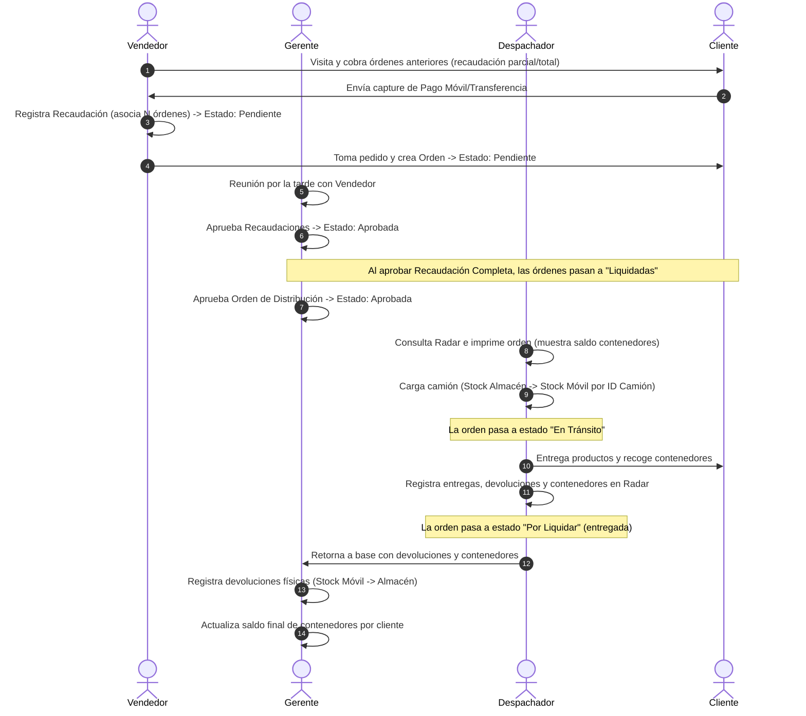

# Ciclo de Despacho de Mercancía y Recaudación — LogiTrack

Este documento detalla el flujo de trabajo operativo y financiero de LogiTrack. Contempla el control del doble inventario (mercancía e inventario retornable de contenedores) y las reglas de negocio para cobranzas.

---

## 1. El Doble Inventario (Mercancía + Contenedores)

Una regla de negocio fundamental en LogiTrack es la gestión de dos inventarios paralelos:
1. **Inventario de Productos:** Los bienes comerciales (almacén principal e inventario móvil del camión).
2. **Inventario de Contenedores/Paquetes Retornables (Envases):** Los recipientes o empaques físicos en los que se transportan los productos y que el cliente final debe devolver a la empresa (ej. huacales, cestas, bombonas, botellas).

### Reglas del Inventario de Contenedores:
*   Cada cliente tiene un **saldo vigente de contenedores** en su poder.
*   Al imprimir una **Orden de Distribución**, se debe mostrar de manera obligatoria el saldo pendiente de contenedores que el cliente tiene acumulado.
*   Durante la entrega:
    *   El chofer entrega productos (lo que genera una entrega de nuevos contenedores).
    *   El cliente devuelve contenedores (los cuales disminuyen su saldo pendiente).
    *   No se exige que el cliente devuelva la misma cantidad de contenedores que recibe en el momento; el saldo se acumula y se netea.
*   Al retornar al almacén, el despachador informa la cantidad total de contenedores retirados por cliente y el gerente actualiza el sistema.

---

## 2. Flujo del Ciclo de Vida: Venta, Despacho y Recaudación

### Detalle de los Estados de la Orden:
1.  **Pendiente:** Creada por el vendedor, a la espera de la aprobación del gerente.
2.  **Aprobada:** Validada por el gerente, lista para ser cargada en el camión por el despachador.
3.  **En Tránsito:** El camión ha sido cargado con la mercancía y está en ruta de entrega.
4.  **Por Liquidar:** La mercancía ha sido entregada (total, parcial o rechazada) por el chofer y la orden está lista para el proceso de cobranza y rendición.
5.  **Liquidada:** Se alcanza este estado **únicamente** desde `por_liquidar` cuando se confirma que las recaudaciones (cobranzas) asociadas cubren la totalidad de la cobranza requerida y el gerente aprueba la rendición.
6.  **Anulada:** Cancelación total.

---

## 3. Decisiones de Diseño y Reglas Técnicas

1.  **Inventario Móvil por ID de Camión:**  
    El inventario móvil se rastrea utilizando la clave primaria única del camión (`camion_id UUID`), ya que la placa del camión puede cambiar o requerir edición, mientras que el ID de referencia es inmutable y consistente en base de datos.
2.  **Relación Recaudación ↔ Órdenes (N:M):**  
    Una única transacción de pago (Recaudación) puede cubrir el saldo de múltiples órdenes de distribución. Por ende, la base de datos debe soportar una relación intermedia para asociar pagos y órdenes.
3.  **Aprobación Financiera Tardía:**  
    La liquidación de la orden no la ejecuta el chofer en el camión de forma automática. El chofer reporta las entregas (inventario), pero el cierre financiero ("Liquidada") ocurre por la tarde cuando el Gerente concilia y aprueba las recaudaciones de cuentas del vendedor.
