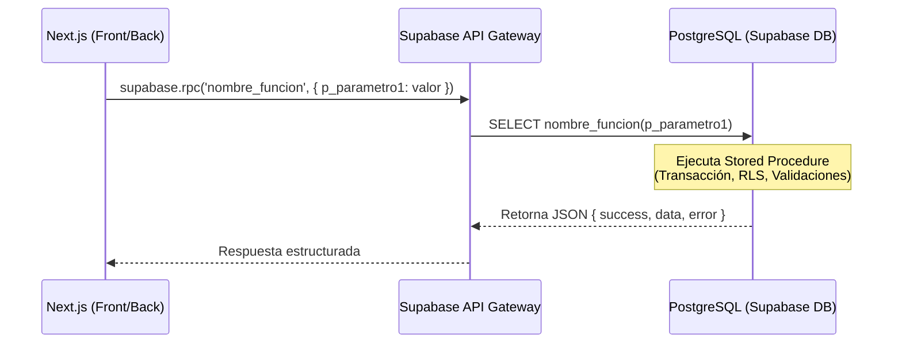

# Documento de Diseño de Sistema (SDD) — Supabase & PostgreSQL

**Proyecto:** LogiTrack  
**Propósito:** Definir los estándares, arquitectura y convenciones para el desarrollo de la base de datos (Stored Procedures, Triggers, RLS y Esqueletos de Tablas) en Supabase, garantizando que el desarrollador del Front/Backend pueda consumirlos sin fricción.  
**Última actualización:** Julio 2026

---

## 1. Arquitectura y Flujo de Comunicación

El flujo de datos del sistema está diseñado de tal forma que la lógica de negocio compleja (reservas de inventario, transiciones de estado de órdenes, conciliación de rendiciones y compras) se ejecute en el servidor de base de datos (PostgreSQL en Supabase) mediante **Stored Procedures (RPC - Remote Procedure Call)**.

El frontend/backend de Next.js **no** realiza consultas INSERT o UPDATE complejas ni transacciones desde el cliente; en su lugar, invoca funciones RPC seguras:



### Beneficios de este enfoque:
1. **Seguridad y RLS:** La lógica de negocio está protegida por políticas a nivel de fila y se ejecuta en un contexto transaccional controlado.
2. **Desacoplamiento:** El equipo de base de datos puede optimizar consultas o cambiar la lógica interna sin necesidad de redesplegar el frontend o el backend de Next.js.
3. **Integridad de Datos:** Garantiza que operaciones críticas (como descontar stock e insertar una orden) se realicen de forma atómica en una sola transacción SQL.

---

## 2. Convenciones de Nomenclatura SQL

Para mantener la base de datos legible y consistente, se deben seguir estrictamente las siguientes reglas de nomenclatura:

### 2.1. Funciones / Stored Procedures
- **Formato:** `snake_case`, todo en minúsculas.
- **Prefijos y verbos:** 
  - Para acciones o mutaciones: `crear_`, `actualizar_`, `eliminar_`, `procesar_`, `anular_`.
  - Para consultas complejas o búsquedas: `retorna_`, `obtener_`.
  - Ejemplo: `crear_orden_distribucion`, `retorna_lista_productos_segun_parametros`.

### 2.2. Parámetros de Funciones
- Todos los parámetros de entrada deben comenzar con el prefijo `p_` para diferenciarlos claramente de las columnas de las tablas en las consultas.
  - Ejemplo: `p_cliente_id`, `p_estado`, `p_cantidad`.

### 2.3. Variables Locales
- Las variables declaradas dentro del bloque `DECLARE` de una función deben llevar el prefijo `v_`.
  - Ejemplo: `v_stock_disponible`, `v_peso_total`, `v_usuario_rol`.

---

## 3. Estándar de Retorno de Datos (Contrato API)

Para facilitar la integración con el programador de Front/Backend, todas las funciones de mutación de base de datos (las que crean, actualizan o ejecutan lógica de negocio) deben devolver un **único objeto JSON** con un formato estructurado y predecible.

### Estructura JSON Estandarizada
```json
{
  "success": boolean,
  "data": object | array | null,
  "error": {
    "code": string,
    "message": string,
    "details": string | null
  } | null
}
```

### Ejemplo de Retorno Exitoso (Success: true)
```json
{
  "success": true,
  "data": {
    "id": "75a40b92-7f28-4034-b258-86d5d590ab8e",
    "correlativo": 1024,
    "estado": "borrador"
  },
  "error": null
}
```

### Ejemplo de Retorno Fallido (Success: false)
```json
{
  "success": false,
  "data": null,
  "error": {
    "code": "STOCK_INSUFICIENTE",
    "message": "No hay suficiente stock en almacén para completar la orden.",
    "details": "Producto ID: a22bc3... - Stock disponible: 5, Solicitado: 10"
  }
}
```

---

## 4. Plantilla de Stored Procedure Estándar

Cualquier Stored Procedure de escritura/mutación debe seguir esta estructura básica, garantizando el manejo de transacciones implícitas de PostgreSQL y el control estructurado de excepciones.

```sql
CREATE OR REPLACE FUNCTION crear_orden_distribucion(
    p_cliente_id UUID,
    p_camion_id UUID,
    p_chofer_id UUID,
    p_factura_origen_numero VARCHAR,
    p_creado_por UUID,
    p_detalles JSONB -- Array de objetos [{producto_id: UUID, cantidad: INT, valor_unitario: NUMERIC}]
)
RETURNS JSON
LANGUAGE plpgsql
SECURITY DEFINER -- Ejecuta con permisos del creador (bypass RLS si es necesario, usar con cuidado)
AS $$
DECLARE
    v_nueva_orden_id UUID;
    v_correlativo INT;
    v_detalle_item JSONB;
    v_peso_total NUMERIC := 0;
    v_producto_peso NUMERIC;
    v_stock_disponible INT;
    v_response JSON;
BEGIN
    -- 1. Iniciar validaciones
    IF p_cliente_id IS NULL THEN
        RETURN json_build_object(
            'success', false,
            'data', NULL,
            'error', json_build_object(
                'code', 'PARAMETRO_INVALIDO',
                'message', 'El ID del cliente es requerido.',
                'details', NULL
            )
        );
    END IF;

    -- Validar si el cliente existe
    IF NOT EXISTS (SELECT 1 FROM clientes WHERE id = p_cliente_id AND activo = TRUE) THEN
        RETURN json_build_object(
            'success', false,
            'data', NULL,
            'error', json_build_object(
                'code', 'CLIENTE_INEXISTENTE',
                'message', 'El cliente especificado no existe o está inactivo.',
                'details', NULL
            )
        );
    END IF;

    -- 2. Procesamiento y Lógica (Ejemplo: bucle sobre JSONB detalles para calcular peso)
    FOR v_detalle_item IN SELECT * FROM jsonb_array_elements(p_detalles) LOOP
        -- Obtener peso unitario y validar stock
        SELECT peso_unitario_kg, stock_disponible INTO v_producto_peso, v_stock_disponible
        FROM productos p
        LEFT JOIN inventario_almacen i ON i.producto_id = p.id
        WHERE p.id = (v_detalle_item->>'producto_id')::UUID;

        IF v_stock_disponible < (v_detalle_item->>'cantidad')::INT THEN
            -- Retorno controlado de error de negocio
            RETURN json_build_object(
                'success', false,
                'data', NULL,
                'error', json_build_object(
                    'code', 'STOCK_INSUFICIENTE',
                    'message', 'Stock insuficiente para el producto: ' || (v_detalle_item->>'producto_id'),
                    'details', 'Disponible: ' || v_stock_disponible || ', Solicitado: ' || (v_detalle_item->>'cantidad')
                )
            );
        END IF;

        v_peso_total := v_peso_total + (v_producto_peso * (v_detalle_item->>'cantidad')::INT);
    END LOOP;

    -- 3. Inserción de Datos (Operación Atómica)
    INSERT INTO ordenes_distribucion (
        cliente_id, camion_id, chofer_id, estado, peso_total_calculado, factura_origen_numero, creado_por
    ) VALUES (
        p_cliente_id, p_camion_id, p_chofer_id, 'borrador', v_peso_total, p_factura_origen_numero, p_creado_por
    ) RETURNING id, correlativo INTO v_nueva_orden_id, v_correlativo;

    -- Insertar el detalle
    FOR v_detalle_item IN SELECT * FROM jsonb_array_elements(p_detalles) LOOP
        INSERT INTO detalle_distribucion (
            orden_id, producto_id, cantidad_solicitada, valor_unitario_recaudar, subtotal_recaudar, estado_entrega
        ) VALUES (
            v_nueva_orden_id,
            (v_detalle_item->>'producto_id')::UUID,
            (v_detalle_item->>'cantidad')::INT,
            (v_detalle_item->>'valor_unitario')::NUMERIC,
            ((v_detalle_item->>'cantidad')::INT * (v_detalle_item->>'valor_unitario')::NUMERIC),
            'pendiente'
        );
    END LOOP;

    -- 4. Respuesta Exitosa
    RETURN json_build_object(
        'success', true,
        'data', json_build_object(
            'orden_id', v_nueva_orden_id,
            'correlativo', v_correlativo,
            'peso_total_calculado', v_peso_total
        ),
        'error', NULL
    );

EXCEPTION
    -- Captura cualquier excepción imprevista (ej. violación de foreign keys, tipos inválidos)
    WHEN OTHERS THEN
        RETURN json_build_object(
            'success', false,
            'data', NULL,
            'error', json_build_object(
                'code', 'SQL_ERROR',
                'message', SQLERRM,
                'details', 'SQLSTATE: ' || SQLSTATE
            )
        );
END;
$$;

---

## 5. Lógica de Negocio Especial: Doble Inventario y Recaudaciones

Para alinearse con las especificaciones de LogiTrack, los Stored Procedures y triggers deben regirse por las siguientes dos lógicas:

### 5.1. Doble Inventario de Contenedores Retornables
*   **Balance Acumulado:** El saldo de contenedores por cliente se incrementa cuando el cliente recibe productos (que vienen en contenedores) y disminuye cuando el cliente devuelve contenedores al chofer.
*   **Control Físico:** En la entrega (`registrar_entrega_detalle`), se debe registrar tanto la mercancía entregada como los contenedores entregados y retirados físicamente.
*   **Actualización del Saldo:** El saldo final del cliente en `saldo_contenedores_clientes` no debe incrementarse directamente en ruta, sino que el procedimiento de liquidación de la orden (`liquidar_orden_distribucion`) o el proceso de aprobación de rendición por parte del gerente consolidará los movimientos y neteará el saldo del cliente.

### 5.2. Recaudación y Cierre Financiero (Liquidación)
*   **Relación Recaudación ↔ Orden:** Una recaudación (`rendiciones_cuentas`) agrupa múltiples órdenes mediante la tabla intermedia `detalle_rendicion_ordenes`.
*   **Transición a "Liquidada":** Una orden de distribución no cambia su estado a `liquidada` de manera automática en ruta. Pasa primero a `en_transito` y luego el chofer entrega la mercancía.
*   **Aprobación del Gerente:** La orden pasa a `liquidada` únicamente cuando el Gerente aprueba la recaudación correspondiente (`rendiciones_cuentas.estado = 'aprobada'`) confirmando que la cobranza está completa. Si la recaudación es parcial o sigue en revisión, la orden debe mantener su estado indicando saldo pendiente.

